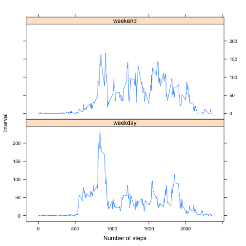

# Reproducible Research: Peer Assessment 1


## Loading and preprocessing the data

```r
table <- read.csv(unz('activity.zip', 'activity.csv'), colClasses = c(date = 'Date'))
```
## What is mean total number of steps taken per day?

```r
total_steps_by_date <- aggregate(steps ~ date, table, 'sum')
hist(total_steps_by_date$steps, 10, main = 'Histogram of Steps Taken Each Day', xlab = 'Number of steps')
```

 

```r
mean_steps_by_date <- mean(total_steps_by_date$steps)
median_steps_by_date <- median(total_steps_by_date$steps)
```
The mean total number of steps taken each day is 1.0766 &times; 10<sup>4</sup>.  
The median total number of steps taken each day is 10765.

## What is the average daily activity pattern?

```r
mean_steps_by_interval <- aggregate(steps ~ interval, table, 'mean')
plot(mean_steps_by_interval, type= 'l', main = 'Average Number of Steps for Each Interval on Average Accross All Days', xlab = 'Interval', ylab = 'Number of steps')
```

 

```r
interval_with_max_mean_steps <- mean_steps_by_interval[which.max(mean_steps_by_interval$steps), 'interval']
```
The 5-minuite interval, on average accross all days, with the maximum number if steps is 835.

## Imputing missing values

```r
sum_na <- sum(!complete.cases(table))
```
The total number of missing values in the dataset is 2304.

We can then fill the missing data with the mean total number of steps taken each day.

```r
filled_table <- table
names(mean_steps_by_interval)[names(mean_steps_by_interval) == 'steps'] <- 'mean'
filled_table<-merge(filled_table, mean_steps_by_interval, by = 'interval')
filled_table$steps[!complete.cases(filled_table)] <- filled_table$mean[!complete.cases(filled_table)]

new_total_steps_by_date <- aggregate(steps ~ date, filled_table, 'sum')
hist(new_total_steps_by_date$steps, 10, main = 'Histogram of Steps Taken Each Day', xlab = 'Number of steps')
```

 

```r
new_mean_steps_by_date <- mean(new_total_steps_by_date$steps)
new_median_steps_by_date <- median(new_total_steps_by_date$steps)
```
The new mean total number of steps taken each day is 1.0766 &times; 10<sup>4</sup>.  
The new median total number of steps taken each day is 1.0766 &times; 10<sup>4</sup>.  
The mean remains the same but the median is now the same as the mean. However, since the mean and median values were close, the impact is negligible.

## Are there differences in activity patterns between weekdays and weekends?

```r
filled_table$week <- 'weekday'
filled_table[weekdays(filled_table$date) %in% c('Saturday', 'Sunday'), 'week'] <- 'weekend'
filled_table$week <- factor(filled_table$week)
mean_steps_by_interval_and_week <- aggregate(steps ~ interval+week, filled_table, 'mean')
library(lattice)
xyplot(steps ~ interval | week, mean_steps_by_interval_and_week, type = 'l', layout = c(1,2), xlab = 'Number of steps', ylab = 'Interval')
```

 
